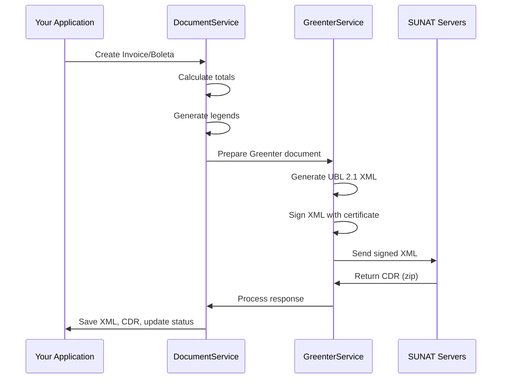

## Overview

The SUNAT Electronic Invoicing API integrates with Peru's tax authority (SUNAT) using the **Greenter** library for XML generation, digital signatures, and document transmission. The system supports both **Beta** (testing) and **Production** environments.

## Architecture

### Service Layers

The integration is organized into three main service layers:

1. **GreenterService** (`app/Services/GreenterService.php`) - Handles XML generation, signing, and SUNAT communication
2. **DocumentService** (`app/Services/DocumentService.php`) - Manages document creation, validation, and totals calculation
3. **ConsultaCpeService** (`app/Services/ConsultaCpeService.php`) - Handles document status queries via SUNAT APIs

### Document Flow



## SUNAT Endpoints

### Configuration

Endpoints are configured per company and environment:

<CodeGroup>
```php GreenterService.php:50-95
protected function initializeSee(): See
{
    $see = new See();
    
    // Use database configurations
    $endpoint = $this->company->getInvoiceEndpoint();
    
    $see->setService($endpoint);
    
    // Configure certificate from file
    try {
        $certificadoPath = storage_path('app/public/certificado/certificado.pem');
        
        if (!file_exists($certificadoPath)) {
            throw new Exception("Certificate file not found: " . $certificadoPath);
        }
        
        $certificadoContent = file_get_contents($certificadoPath);
        
        if ($certificadoContent === false) {
            throw new Exception("Could not read certificate file");
        }
        
        $see->setCertificate($certificadoContent);
        Log::info("Certificate loaded from file: " . $certificadoPath);
    } catch (Exception $e) {
        Log::error("Error configuring certificate: " . $e->getMessage());
        throw new Exception("Error configuring certificate: " . $e->getMessage());
    }
    
    // Configure SOL credentials
    $see->setClaveSOL(
        $this->company->ruc,
        $this->company->usuario_sol,
        $this->company->clave_sol
    );
    
    // Configure cache
    $cachePath = storage_path('app/greenter/cache');
    if (!file_exists($cachePath)) {
        mkdir($cachePath, 0755, true);
    }
    $see->setCachePath($cachePath);

    return $see;
}
```
</CodeGroup>

### Service Endpoints

<AccordionGroup>
<Accordion title="Invoices and Notes (Facturacion)">
**Beta Environment:**
```
https://e-beta.sunat.gob.pe/ol-ti-itcpfegem-beta/billService
```

**Production Environment:**
```
https://e-factura.sunat.gob.pe/ol-ti-itcpfegem/billService
```

Used for:
- Invoices (01)
- Boletas (03) - via daily summaries
- Credit Notes (07)
- Debit Notes (08)
</Accordion>

<Accordion title="Dispatch Guides (Guias de Remision)">
**Beta Environment:**
```
https://api-cpe.sunat.gob.pe/v1/contribuyente/gem
```

**Production Environment:**
```
https://api-cpe.sunat.gob.pe/v1/contribuyente/gem
```

Used for:
- Dispatch Guides (09) - GRE (Guía de Remisión Electrónica)

Requires API authentication instead of SOAP.
</Accordion>

<Accordion title="Document Status Query (Consulta CPE)">
**OAuth2 Endpoint:**
```
https://api.sunat.gob.pe/v1/contribuyente/contribuyentes (production)
https://api-beta.sunat.gob.pe/v1/contribuyente/contribuyentes (beta)
```

**SOAP Endpoint:**
```
https://e-factura.sunat.gob.pe/ol-it-wsconscpegem/billConsultService?wsdl
```
</Accordion>
</AccordionGroup>

## Sending Documents to SUNAT

### Invoice/Boleta Submission

<CodeGroup>
```php DocumentService.php:180-279
public function sendToSunat($document, string $documentType): array
{
    try {
        $company = $document->company;
        $greenterService = new GreenterService($company);
        
        // Prepare data for Greenter
        $documentData = $this->prepareDocumentData($document, $documentType);
        
        // Create Greenter document
        $greenterDocument = null;
        switch ($documentType) {
            case 'invoice':
                $greenterDocument = $greenterService->createInvoice($documentData);
                break;
            case 'boleta':
                $greenterDocument = $greenterService->createInvoice($documentData);
                break;
            case 'credit_note':
            case 'debit_note':
                $greenterDocument = $greenterService->createNote($documentData);
                break;
        }
        
        if (!$greenterDocument) {
            throw new Exception('Could not create document for Greenter');
        }
        
        // Send to SUNAT
        $result = $greenterService->sendDocument($greenterDocument);
        
        // Save files
        if ($result['xml']) {
            $xmlPath = $this->fileService->saveXml($document, $result['xml']);
            $document->xml_path = $xmlPath;
        }
        
        if ($result['success'] && $result['cdr_zip']) {
            $cdrPath = $this->fileService->saveCdr($document, $result['cdr_zip']);
            $document->cdr_path = $cdrPath;
            
            $document->estado_sunat = 'ACEPTADO';
            $document->respuesta_sunat = json_encode([
                'id' => $result['cdr_response']->getId(),
                'code' => $result['cdr_response']->getCode(),
                'description' => $result['cdr_response']->getDescription(),
                'notes' => $result['cdr_response']->getNotes(),
            ]);
            
            // Get hash from XML
            $xmlSigned = $greenterService->getXmlSigned($greenterDocument);
            if ($xmlSigned) {
                $document->codigo_hash = $this->extractHashFromXml($xmlSigned);
            }
        } else {
            $document->estado_sunat = 'RECHAZADO';
            
            // Handle different error types
            $errorCode = 'UNKNOWN';
            $errorMessage = 'Unknown error';
            
            if (is_object($result['error'])) {
                if (method_exists($result['error'], 'getCode')) {
                    $errorCode = $result['error']->getCode();
                } elseif (property_exists($result['error'], 'code')) {
                    $errorCode = $result['error']->code;
                }
                
                if (method_exists($result['error'], 'getMessage')) {
                    $errorMessage = $result['error']->getMessage();
                } elseif (property_exists($result['error'], 'message')) {
                    $errorMessage = $result['error']->message;
                }
            }
            
            $document->respuesta_sunat = json_encode([
                'code' => $errorCode,
                'message' => $errorMessage,
            ]);
        }
        
        $document->save();
        
        return [
            'success' => $result['success'],
            'document' => $document,
            'error' => $result['success'] ? null : $result['error']
        ];
        
    } catch (Exception $e) {
        return [
            'success' => false,
            'document' => $document,
            'error' => (object)[
                'code' => 'EXCEPTION',
                'message' => $e->getMessage()
            ]
        ];
    }
}
```

```php GreenterService.php:524-548
public function sendDocument($document)
{
    try {
        $result = $this->see->send($document);
        
        return [
            'success' => $result->isSuccess(),
            'xml' => $this->see->getFactory()->getLastXml(),
            'cdr_response' => $result->isSuccess() ? $result->getCdrResponse() : null,
            'cdr_zip' => $result->isSuccess() ? $result->getCdrZip() : null,
            'error' => $result->isSuccess() ? null : $result->getError()
        ];
    } catch (Exception $e) {
        return [
            'success' => false,
            'xml' => null,
            'cdr_response' => null,
            'cdr_zip' => null,
            'error' => (object)[
                'code' => 'EXCEPTION',
                'message' => $e->getMessage()
            ]
        ];
    }
}
```
</CodeGroup>

### Response Structure

Successful SUNAT responses include:

<ResponseField name="success" type="boolean">
  Indicates if the document was accepted by SUNAT
</ResponseField>

<ResponseField name="xml" type="string">
  Signed XML content (UBL 2.1 format)
</ResponseField>

<ResponseField name="cdr_response" type="object">
  Constancia de Recepción response object:
  - `id` - CDR identifier
  - `code` - Response code (0 = accepted)
  - `description` - Response description
  - `notes` - Additional notes (warnings, observations)
</ResponseField>

<ResponseField name="cdr_zip" type="string">
  ZIP file containing the CDR XML signed by SUNAT
</ResponseField>

<ResponseField name="error" type="object">
  Error details if rejected:
  - `code` - Error code
  - `message` - Error description
</ResponseField>

## CDR Handling

### What is a CDR?

The **CDR (Constancia de Recepción)** is SUNAT's signed response confirming receipt and validation of your electronic document. It's a digitally signed XML file contained in a ZIP archive.

<Note>
The CDR is **legal proof** that SUNAT received and accepted your document. Always store CDRs securely for auditing purposes.
</Note>

### CDR Processing

<CodeGroup>
```php FileService.php:18-24
public function saveCdr($document, string $cdrContent): string
{
    $this->ensureDirectoryExists($document, 'zip');
    $path = $this->generatePath($document, 'zip');
    Storage::disk('public')->put($path, $cdrContent);
    return $path;
}
```

```php FileService.php:34-62
protected function generatePath($document, string $extension, string $format = 'A4'): string
{
    $date = Carbon::parse($document->fecha_emision);
    $dateFolder = $date->format('dmY'); // Format: 02092025
    
    $fileName = $document->numero_completo;
    
    // Get document type
    $tipoComprobante = $this->getDocumentTypeName($document);
    
    // Determine file type (xml, cdr or pdf)
    $tipoArchivo = $extension === 'zip' ? 'cdr' : $extension;
    
    // Create structure: DOCUMENT_TYPE/FILE_TYPE/DDMMYYYY/
    $directory = "{$tipoComprobante}/{$tipoArchivo}/{$dateFolder}";
    
    // Prefix based on file type
    $prefix = '';
    if ($extension === 'zip') {
        $prefix = 'R-'; // CDR
    }
    
    // For PDFs, add format to filename if not A4
    if ($extension === 'pdf' && $format !== 'A4') {
        $fileName .= "_{$format}";
    }
    
    return "{$directory}/{$prefix}{$fileName}.{$extension}";
}
```
</CodeGroup>

### CDR File Structure

Example CDR path for invoice F001-00000123 issued on September 2, 2025:

```
storage/app/public/facturas/cdr/02092025/R-F001-00000123.zip
```

The ZIP contains:
- `R-20123456789-01-F001-00000123.xml` - Signed CDR XML

## Document Status Query

Query document status using OAuth2 API or traditional SOAP:

<CodeGroup>
```php ConsultaCpeService.php:36-95
public function consultarComprobante($documento): array
{
    try {
        // Get valid token
        $token = $this->obtenerTokenValido();
        
        if (!$token) {
            return [
                'success' => false,
                'message' => 'Could not obtain authentication token',
                'data' => null
            ];
        }

        // Configure query API
        $config = Configuration::getDefaultConfiguration()
            ->setAccessToken($token)
            ->setHost($this->getApiHost());

        $apiInstance = new ConsultaApi(new Client(), $config);

        // Create query filter
        $cpeFilter = $this->crearFiltroCpe($documento);
        
        // Perform query
        $result = $apiInstance->consultarCpe($this->company->ruc, $cpeFilter);

        if (!$result->getSuccess()) {
            return [
                'success' => false,
                'message' => $result->getMessage(),
                'data' => null
            ];
        }

        // Process response
        $estados = $this->procesarEstadosComprobante($result->getData());
        
        // Update document with status
        $this->actualizarEstadoDocumento($documento, $estados);

        return [
            'success' => true,
            'message' => 'Query completed successfully',
            'data' => $estados,
            'comprobante_codigo' => "{$documento->serie}-{$documento->correlativo}",
            'metodo' => 'api_oauth2'
        ];

    } catch (Exception $e) {
        Log::error('Error in CPE API query: ' . $e->getMessage());

        // Fallback to traditional query if OAuth2 API fails
        return $this->consultarComprobanteSol($documento);
    }
}
```
</CodeGroup>

### Status Codes

<ResponseField name="estadoCpe" type="string">
  Document status:
  - `0` - Does not exist
  - `1` - Accepted
  - `2` - Annulled
  - `3` - Authorized
  - `-1` - Query error
</ResponseField>

## Common SUNAT Response Codes

<Warning>
Always handle SUNAT error codes gracefully and provide meaningful feedback to users.
</Warning>

| Code | Description | Action Required |
|------|-------------|----------------|
| **0** | Accepted | Document was accepted successfully |
| **98** | Accepted with observations | Check `notes` array for warnings |
| **2324** | Invalid RUC | Verify company RUC configuration |
| **2335** | Duplicate document | Document with same series-correlative already exists |
| **2800** | Invalid XML schema | Check UBL 2.1 compliance |
| **2801** | Invalid signature | Verify digital certificate |
| **1033** | RUC not authorized | Company must be authorized for electronic invoicing |
| **1032** | RUC suspended | Company has tax irregularities |

## Error Handling

<CodeGroup>
```php Example Implementation
try {
    $result = $documentService->sendToSunat($invoice, 'invoice');
    
    if ($result['success']) {
        // Document accepted
        $cdrPath = $result['document']->cdr_path;
        $hash = $result['document']->codigo_hash;
        
        return response()->json([
            'success' => true,
            'message' => 'Invoice sent successfully',
            'cdr_path' => $cdrPath,
            'hash' => $hash
        ]);
    } else {
        // Document rejected
        $error = $result['error'];
        
        Log::warning('Invoice rejected by SUNAT', [
            'code' => $error->code ?? 'UNKNOWN',
            'message' => $error->message ?? 'Unknown error',
            'invoice_id' => $invoice->id
        ]);
        
        return response()->json([
            'success' => false,
            'message' => $error->message ?? 'Error sending to SUNAT',
            'code' => $error->code ?? 'UNKNOWN'
        ], 400);
    }
} catch (Exception $e) {
    Log::error('Exception sending invoice', [
        'message' => $e->getMessage(),
        'invoice_id' => $invoice->id
    ]);
    
    return response()->json([
        'success' => false,
        'message' => 'Internal error: ' . $e->getMessage()
    ], 500);
}
```
</CodeGroup>

## Best Practices

<AccordionGroup>
<Accordion title="Certificate Management">
1. Store certificates securely in `storage/app/public/certificado/`
2. Use PEM format with private key and certificate combined
3. Set proper file permissions (600 or 640)
4. Renew certificates before expiration
5. Test with Beta environment first
</Accordion>

<Accordion title="Endpoint Configuration">
1. Always configure both Beta and Production endpoints
2. Use environment variables for sensitive data
3. Test thoroughly in Beta before going to Production
4. Keep endpoints updated (SUNAT occasionally changes URLs)
</Accordion>

<Accordion title="CDR Storage">
1. Store CDRs permanently for audit compliance
2. Use organized directory structure by date and type
3. Implement backup strategies
4. Never delete CDRs (legal requirement)
5. Consider archiving old CDRs to cold storage
</Accordion>

<Accordion title="Error Handling">
1. Log all SUNAT interactions
2. Implement retry logic for network errors
3. Validate documents before sending
4. Provide clear error messages to users
5. Monitor error rates and patterns
</Accordion>
</AccordionGroup>

## Next Steps

<CardGroup cols={2}>
  <Card title="XML Signing" icon="file-signature" href="/advanced/xml-signing">
    Learn about digital signatures and UBL 2.1 structure
  </Card>
  <Card title="CDR Handling" icon="file-check" href="/advanced/cdr-handling">
    Deep dive into CDR processing and validation
  </Card>
  <Card title="Daily Summaries" icon="calendar-days" href="/advanced/daily-summaries">
    Sending boletas via daily summary documents
  </Card>
  <Card title="Voided Documents" icon="ban" href="/advanced/voided-documents">
    Annulling documents with comunicaciones de baja
  </Card>
</CardGroup>
