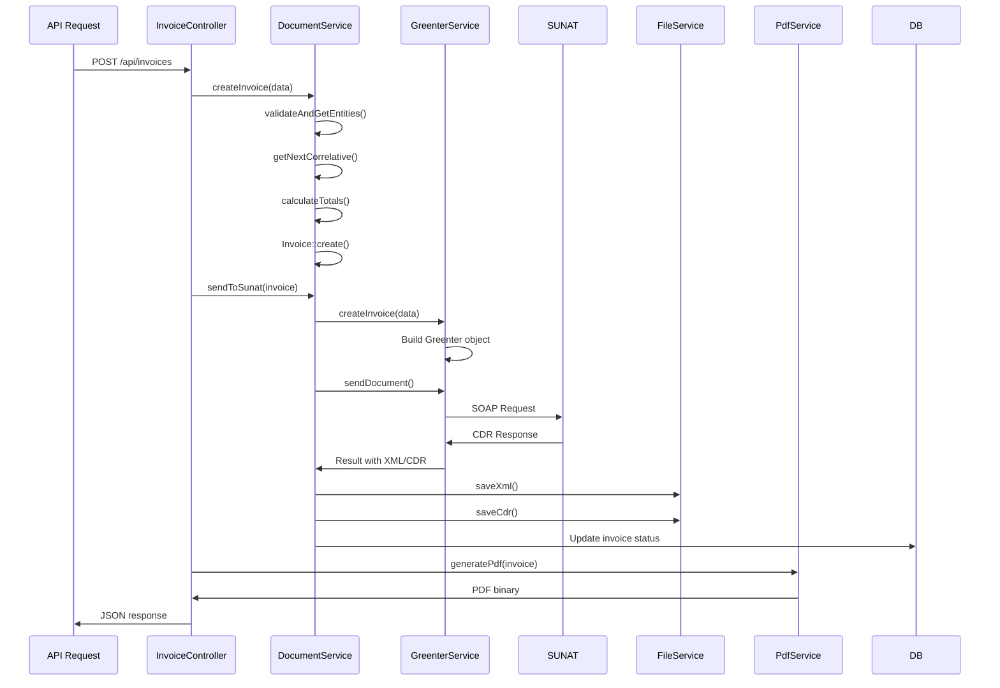

## Overview

The SUNAT Electronic Invoicing API is built on Laravel 11 and follows a service-oriented architecture with clear separation of concerns. The system handles electronic document generation, SUNAT communication, and PDF generation.

## Architectural Layers

### 1. Models Layer

Eloquent models represent core business entities and handle data persistence.

#### Company Model

**Location:** `app/Models/Company.php`

The Company model is the central entity that holds SUNAT credentials and configurations.

```php app/Models/Company.php
protected $fillable = [
    'ruc',
    'razon_social',
    'nombre_comercial',
    'direccion',
    'ubigeo',
    'distrito',
    'provincia',
    'departamento',
    'usuario_sol',          // SUNAT SOL credentials
    'clave_sol',
    'certificado_pem',      // Digital certificate
    'certificado_password',
    'gre_client_id_beta',   // GRE credentials for beta
    'gre_client_secret_beta',
    'gre_client_id_produccion',
    'gre_client_secret_produccion',
    'modo_produccion',      // Beta vs Production mode
    // ... more fields
];
```

**Key Relationships:**
- `hasMany(Branch::class)` - Multiple branches per company
- `hasMany(Invoice::class)` - All invoices
- `hasMany(Boleta::class)` - All sales receipts (boletas)
- `hasMany(CompanyConfiguration::class)` - Configuration settings

**Key Methods:**
```php
// Get current environment endpoint
public function getInvoiceEndpoint(): string

// Get GRE credentials based on environment
public function getGreCredentials(): array

// Check if GRE credentials are configured
public function hasGreCredentials(): bool
```

#### Branch Model

**Location:** `app/Models/Branch.php`

Branches (sucursales) represent physical locations within a company.

```php app/Models/Branch.php
protected $fillable = [
    'company_id',
    'codigo',
    'nombre',
    'direccion',
    'series_factura',       // Invoice series: ['F001', 'F002']
    'series_boleta',        // Boleta series: ['B001', 'B002']
    'series_nota_credito',  // Credit note series
    'series_nota_debito',   // Debit note series
    'series_guia_remision', // Dispatch guide series
];
```

**Key Methods:**
```php
// Get next correlative number for a document type and series
public function getNextCorrelative(string $tipoDocumento, string $serie): string
{
    $correlative = $this->correlatives()
        ->where('tipo_documento', $tipoDocumento)
        ->where('serie', $serie)
        ->lockForUpdate()  // Prevents race conditions
        ->first();
    
    if (!$correlative) {
        $correlative = $this->correlatives()->create([
            'tipo_documento' => $tipoDocumento,
            'serie' => $serie,
            'correlativo_actual' => 0,
        ]);
    }
    
    $correlative->increment('correlativo_actual');
    return str_pad((string)$correlative->correlativo_actual, 6, '0', STR_PAD_LEFT);
}
```

### 2. Services Layer

Services contain business logic and external integrations.

#### DocumentService

**Location:** `app/Services/DocumentService.php`

Handles document creation, tax calculation, and SUNAT communication orchestration.

```php app/Services/DocumentService.php
class DocumentService
{
    protected $fileService;
    protected $pdfService;

    public function __construct(FileService $fileService, PdfService $pdfService)
    {
        $this->fileService = $fileService;
        $this->pdfService = $pdfService;
    }
}
```

**Key Methods:**

<Accordion title="createInvoice() - Create Invoice with Automatic Tax Calculation">
```php
public function createInvoice(array $data): Invoice
{
    return DB::transaction(function () use ($data) {
        // Validate entities
        $company = Company::findOrFail($data['company_id']);
        $branch = Branch::where('company_id', $company->id)
                       ->where('id', $data['branch_id'])
                       ->firstOrFail();
        
        // Get or create client
        $client = $this->getOrCreateClient($data['client']);
        
        // Get next correlative (thread-safe)
        $serie = $data['serie'];
        $correlativo = $branch->getNextCorrelative('01', $serie);
        
        // Calculate totals automatically
        $totals = $this->calculateTotals($data['detalles'], $globalData);
        
        // Create invoice
        $invoice = Invoice::create([
            'company_id' => $company->id,
            'branch_id' => $branch->id,
            'client_id' => $client->id,
            'tipo_documento' => '01',
            'serie' => $serie,
            'correlativo' => $correlativo,
            'numero_completo' => $serie . '-' . $correlativo,
            // ... tax calculations from $totals
            'mto_igv' => $totals['mto_igv'],
            'mto_imp_venta' => $totals['mto_imp_venta'],
            // ...
        ]);

        return $invoice;
    });
}
```
</Accordion>

<Accordion title="calculateTotals() - Automatic Tax Calculation Engine">
This method handles all SUNAT tax types including IGV, ISC, ICBPER, IVAP, and gratuitas (free items).

```php
protected function calculateTotals(array &$detalles, array $globalData = []): array
{
    $totals = [
        'mto_oper_gravadas' => 0,    // Taxable operations
        'mto_oper_exoneradas' => 0,  // Tax-exempt operations
        'mto_oper_inafectas' => 0,   // Non-taxable operations
        'mto_oper_gratuitas' => 0,   // Free items
        'mto_igv' => 0,              // IGV (18%)
        'mto_isc' => 0,              // ISC (selective consumption)
        'mto_icbper' => 0,           // Plastic bag tax
        'mto_base_ivap' => 0,        // IVAP base (rice tax)
        'mto_ivap' => 0,             // IVAP amount
    ];

    foreach ($detalles as &$detalle) {
        $tipAfeIgv = $detalle['tip_afe_igv'];
        
        // Calculate according to tax affectation type
        switch ($tipAfeIgv) {
            case '10': // Taxable - IGV
                $totals['mto_oper_gravadas'] += $mtoValorVenta;
                $totals['mto_igv'] += $igv;
                break;
            case '17': // Taxable - IVAP (rice)
                $totals['mto_base_ivap'] += $mtoValorVenta;
                $totals['mto_ivap'] += $igv;
                break;
            case '20': // Exempt
                $totals['mto_oper_exoneradas'] += $mtoValorVenta;
                break;
            // ... other cases
        }
    }

    return $totals;
}
```
</Accordion>

<Accordion title="sendToSunat() - Send Documents to SUNAT">
```php
public function sendToSunat($document, string $documentType): array
{
    try {
        $company = $document->company;
        $greenterService = new GreenterService($company);
        
        // Prepare document data
        $documentData = $this->prepareDocumentData($document, $documentType);
        
        // Create Greenter document
        $greenterDocument = $greenterService->createInvoice($documentData);
        
        // Send to SUNAT
        $result = $greenterService->sendDocument($greenterDocument);
        
        // Save XML and CDR files
        if ($result['xml']) {
            $xmlPath = $this->fileService->saveXml($document, $result['xml']);
            $document->xml_path = $xmlPath;
        }
        
        if ($result['success'] && $result['cdr_zip']) {
            $cdrPath = $this->fileService->saveCdr($document, $result['cdr_zip']);
            $document->cdr_path = $cdrPath;
            $document->estado_sunat = 'ACEPTADO';
        } else {
            $document->estado_sunat = 'RECHAZADO';
        }
        
        $document->save();
        return ['success' => $result['success'], 'document' => $document];
        
    } catch (Exception $e) {
        return ['success' => false, 'error' => $e->getMessage()];
    }
}
```
</Accordion>

#### GreenterService

**Location:** `app/Services/GreenterService.php`

Wrpper for the Greenter library (thegreenter/greenter) which communicates with SUNAT web services.

```php app/Services/GreenterService.php
use Greenter\See;
use Greenter\Model\Sale\Invoice as GreenterInvoice;

class GreenterService
{
    protected $see;
    protected $seeApi;  // For dispatch guides (GRE)
    protected $company;

    public function __construct(Company $company)
    {
        $this->company = $company;
        $this->see = $this->initializeSee();
        $this->seeApi = $this->initializeSeeApi();
    }
}
```

**Key Methods:**

<Accordion title="initializeSee() - Configure SUNAT Connection">
```php
protected function initializeSee(): See
{
    $see = new See();
    
    // Get endpoint based on production mode
    $endpoint = $this->company->getInvoiceEndpoint();
    $see->setService($endpoint);
    
    // Load digital certificate
    $certificadoPath = storage_path('app/public/certificado/certificado.pem');
    $certificadoContent = file_get_contents($certificadoPath);
    $see->setCertificate($certificadoContent);
    
    // Set SOL credentials
    $see->setClaveSOL(
        $this->company->ruc,
        $this->company->usuario_sol,
        $this->company->clave_sol
    );
    
    // Configure cache
    $cachePath = storage_path('app/greenter/cache');
    $see->setCachePath($cachePath);

    return $see;
}
```
</Accordion>

<Accordion title="createInvoice() - Build Greenter Invoice Object">
```php
public function createInvoice(array $invoiceData): GreenterInvoice
{
    $invoice = new GreenterInvoice();
    
    $invoice->setUblVersion($invoiceData['ubl_version'] ?? '2.1')
            ->setTipoOperacion($invoiceData['tipo_operacion'] ?? '0101')
            ->setTipoDoc($invoiceData['tipo_documento'])
            ->setSerie($invoiceData['serie'])
            ->setCorrelativo($invoiceData['correlativo'])
            ->setFechaEmision(new \DateTime($invoiceData['fecha_emision']))
            ->setTipoMoneda($invoiceData['moneda'] ?? 'PEN');

    // Company and client
    $invoice->setCompany($this->getGreenterCompany())
            ->setClient($this->getGreenterClient($invoiceData['client']));

    // Tax amounts
    $invoice->setMtoOperGravadas($invoiceData['mto_oper_gravadas'])
            ->setMtoIGV($invoiceData['mto_igv'])
            ->setTotalImpuestos($invoiceData['total_impuestos'])
            ->setMtoImpVenta($invoiceData['mto_imp_venta']);

    // Line items
    $details = $this->createSaleDetails($invoiceData['detalles']);
    $invoice->setDetails($details);

    return $invoice;
}
```
</Accordion>

<Accordion title="sendDocument() - Send to SUNAT and Get CDR Response">
```php
public function sendDocument($document)
{
    try {
        $result = $this->see->send($document);
        
        return [
            'success' => $result->isSuccess(),
            'xml' => $this->see->getFactory()->getLastXml(),
            'cdr_response' => $result->isSuccess() ? $result->getCdrResponse() : null,
            'cdr_zip' => $result->isSuccess() ? $result->getCdrZip() : null,
            'error' => $result->isSuccess() ? null : $result->getError()
        ];
    } catch (Exception $e) {
        return [
            'success' => false,
            'error' => (object)[
                'code' => 'EXCEPTION',
                'message' => $e->getMessage()
            ]
        ];
    }
}
```
</Accordion>

#### PdfService

**Location:** `app/Services/PdfService.php`

Generates PDF representations of electronic documents using DomPDF.

```php app/Services/PdfService.php
use Dompdf\Dompdf;
use BaconQrCode\Writer;

class PdfService
{
    const FORMATS = [
        'A4' => ['width' => 210, 'height' => 297, 'unit' => 'mm'],
        'A5' => ['width' => 148, 'height' => 210, 'unit' => 'mm'],
        '80mm' => ['width' => 80, 'height' => 200, 'unit' => 'mm'],
        'ticket' => ['width' => 50, 'height' => 150, 'unit' => 'mm'],
    ];

    public function generateInvoicePdf($invoice, string $format = 'A4'): string
    {
        $data = $this->prepareInvoiceData($invoice);
        $data['format'] = $format;
        
        $template = $this->getTemplate('invoice', $format);
        $html = View::make($template, $data)->render();
        
        $pdf = $this->createPdfInstance($html, $format);
        return $pdf->output();
    }
}
```

**Key Features:**
- Multiple format support (A4, A5, 80mm ticket, 50mm ticket)
- QR code generation following SUNAT standard
- Number to words conversion for totals
- Dynamic template selection

### 3. Configuration Management

**Trait:** `HasCompanyConfigurations`  
**Location:** `app/Traits/HasCompanyConfigurations.php`

Provides flexible configuration management with environment-specific settings.

```php
public function getConfig(string $configType, string $environment = null, string $serviceType = null)
{
    $environment = $environment ?? ($this->modo_produccion ? 'produccion' : 'beta');
    
    return Cache::remember($cacheKey, 3600, function () use ($configType, $environment, $serviceType) {
        $config = $this->activeConfigurations()
            ->where('config_type', $configType)
            ->where('environment', $environment)
            ->when($serviceType, fn($q) => $q->where('service_type', $serviceType))
            ->first();
        
        return $config ? $config->config_data : null;
    });
}
```

## Data Flow

### Invoice Creation Flow



## Design Patterns

### Repository Pattern (Implicit)
Eloquent models act as repositories with scopes and query builders.

### Service Layer Pattern
Business logic is encapsulated in service classes (DocumentService, GreenterService, PdfService).

### Dependency Injection
```php
public function __construct(FileService $fileService, PdfService $pdfService)
{
    $this->fileService = $fileService;
    $this->pdfService = $pdfService;
}
```

### Factory Pattern
GreenterService creates Greenter objects (invoices, notes, guides) based on document types.

### Transaction Script Pattern
DocumentService methods use database transactions to ensure data consistency:
```php
return DB::transaction(function () use ($data) {
    // Multiple operations in single transaction
});
```

## Key Features

<CardGroup cols={2}>
  <Card title="Automatic Tax Calculation" icon="calculator">
    Calculates IGV, ISC, ICBPER, IVAP automatically based on affectation types
  </Card>
  <Card title="Thread-Safe Correlatives" icon="lock">
    Uses database locking to prevent duplicate document numbers
  </Card>
  <Card title="Multi-Environment" icon="globe">
    Separate configurations for Beta and Production SUNAT environments
  </Card>
  <Card title="Flexible Configuration" icon="gear">
    Environment-specific settings with caching for performance
  </Card>
</CardGroup>

## File Structure

```
app/
├── Models/
│   ├── Company.php          # Central company entity
│   ├── Branch.php           # Branch/location management
│   ├── Invoice.php          # Invoice model (01)
│   ├── Boleta.php           # Sales receipt model (03)
│   ├── CreditNote.php       # Credit note model (07)
│   ├── DebitNote.php        # Debit note model (08)
│   └── User.php             # User authentication
├── Services/
│   ├── DocumentService.php  # Document creation and SUNAT orchestration
│   ├── GreenterService.php  # SUNAT communication wrapper
│   ├── PdfService.php       # PDF generation
│   └── FileService.php      # XML/CDR/PDF file storage
├── Http/
│   └── Controllers/Api/
│       ├── InvoiceController.php
│       ├── BoletaController.php
│       └── AuthController.php
└── Traits/
    └── HasCompanyConfigurations.php  # Configuration management
```

## Next Steps

<CardGroup cols={2}>
  <Card title="Authentication" icon="key" href="/concepts/authentication">
    Learn about Laravel Sanctum authentication and token management
  </Card>
  <Card title="Certificate Setup" icon="certificate" href="/concepts/certificate-setup">
    Configure SUNAT digital certificates (.pfx/.pem)
  </Card>
</CardGroup>