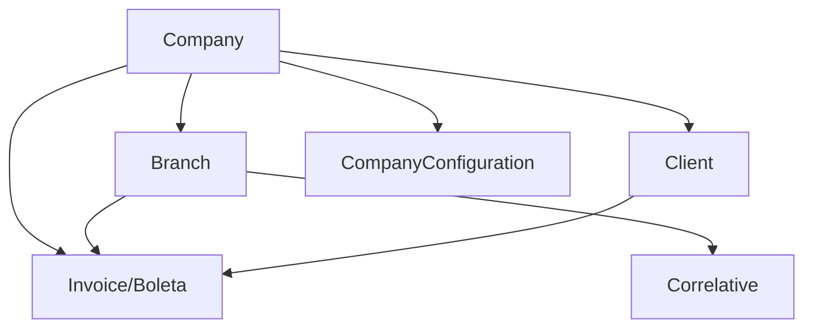

# SUNAT Electronic Invoicing API

A comprehensive electronic invoicing system for SUNAT Peru, developed with **Laravel 12** and **Greenter 5.1**. This API implements all necessary functionalities for generating, sending, and managing electronic payment vouchers according to SUNAT regulations.

## What is SUNAT Electronic Invoicing?

SUNAT (Superintendencia Nacional de Aduanas y de Administración Tributaria) requires businesses in Peru to issue electronic invoices and receipts. This API provides a complete solution for:

- **Generating** valid XML documents according to SUNAT specifications
- **Sending** documents to SUNAT for validation and approval
- **Managing** certificates, credentials, and company configurations
- **Creating** professional PDF representations with QR codes
- **Handling** responses (CDR) from SUNAT

## Key Features

### Supported Electronic Documents

<CardGroup cols={2}>
  <Card title="Facturas" icon="file-invoice">
    Electronic invoices (Type 01) for B2B transactions
  </Card>
  <Card title="Boletas de Venta" icon="receipt">
    Sales receipts (Type 03) for B2C transactions
  </Card>
</CardGroup>

### System Capabilities

<AccordionGroup>
  <Accordion title="Multi-Company Support">
    Manage multiple companies and branches from a single installation. Each company can have:
    - Independent RUC and credentials
    - Separate SUNAT certificates
    - Multiple branches with their own document series
    - Custom tax configurations
  </Accordion>

  <Accordion title="OAuth2 Authentication">
    Secure API access using Laravel Sanctum with:
    - Token-based authentication
    - Role-based permissions
    - IP verification and login tracking
    - Automatic token rotation
  </Accordion>

  <Accordion title="Automatic PDF Generation">
    Professional PDF documents with:
    - QR codes for validation
    - Digital hash inclusion
    - Company logo and branding
    - A4 and custom formats
  </Accordion>

  <Accordion title="SUNAT Integration">
    Direct integration with SUNAT services:
    - Real-time document validation
    - CDR (Constancia de Recepción) handling
    - Beta and production environments
    - Automatic retry mechanisms
  </Accordion>
</AccordionGroup>

## Technology Stack

| Component | Technology | Version |
|-----------|------------|--------|
| Framework | Laravel | 12 |
| PHP | PHP | 8.2+ |
| SUNAT Library | Greenter | 5.1 |
| Database | MySQL/PostgreSQL | 8.0+ / 12+ |
| PDF Generation | DomPDF | 3.1 |
| QR Codes | Endroid QR Code | Latest |
| Authentication | Laravel Sanctum | 4.0 |
| Testing | PestPHP | 4.0 |

## Architecture Overview

### Data Models

The system uses a normalized database structure:



**Core Models:**
- `Company` - Issuing companies with SUNAT credentials
- `Branch` - Branch offices for each company
- `Client` - Customers and suppliers
- `Invoice` / `Boleta` - Electronic documents
- `CompanyConfiguration` - Per-company settings
- `Correlative` - Document series and numbering

### Service Layer

The API implements a clean service-oriented architecture:

- **DocumentService** - Business logic for document creation and validation
- **GreenterService** - SUNAT integration using Greenter library
- **PdfService** - PDF generation with templates
- **FileService** - XML/PDF/CDR file management
- **CompanyConfigService** - Configuration management

## Who Should Use This API?

<CardGroup cols={2}>
  <Card title="Software Developers" icon="code">
    Integrate SUNAT electronic invoicing into existing systems or build new invoicing solutions.
  </Card>
  
  <Card title="Accounting Software" icon="calculator">
    Add compliant electronic invoicing to accounting and ERP platforms.
  </Card>
  
  <Card title="E-commerce Platforms" icon="cart-shopping">
    Generate invoices and receipts automatically for online sales.
  </Card>
  
  <Card title="POS Systems" icon="cash-register">
    Issue electronic receipts directly from point-of-sale systems.
  </Card>
</CardGroup>

## Compliance & Standards

This API is fully compliant with:

<Check>UBL 2.1 (Universal Business Language) standard</Check>
<Check>SUNAT electronic invoicing regulations</Check>
<Check>Digital signature requirements using .pfx/.pem certificates</Check>
<Check>XML Schema validation for all document types</Check>
<Check>CDR (Constancia de Recepción) processing</Check>

## Environment Support

The API supports both SUNAT environments:

<CodeGroup>
```bash Beta (Testing)
https://e-beta.sunat.gob.pe/ol-ti-itcpfegem-beta/billService
```

```bash Production
https://e-factura.sunat.gob.pe/ol-ti-itcpfegem/billService
```
</CodeGroup>

<Note>
Always test thoroughly in the **Beta environment** before switching to production. SUNAT provides test credentials and certificates for the beta environment.
</Note>

## Getting Started

Ready to start issuing electronic invoices? Follow our guides:

<CardGroup cols={2}>
  <Card title="Quickstart" icon="rocket" href="/quickstart">
    Get your first invoice created in 10 minutes
  </Card>
  
  <Card title="Installation" icon="download" href="/installation">
    Complete installation and configuration guide
  </Card>
  
  <Card title="API Reference" icon="book" href="/api-reference">
    Explore all available endpoints
  </Card>
  
  <Card title="Examples" icon="code" href="/examples">
    Real-world implementation examples
  </Card>
</CardGroup>

## License & Usage

This project is **open source** and **free to use** under the following conditions:

<Check>Use, modify, and distribute the code freely</Check>
<Check>Use for commercial and personal projects</Check>
<Warning>All usage is at your own responsibility</Warning>
<Warning>No official warranty or support provided</Warning>
<Warning>You must comply with SUNAT regulations in your country</Warning>

## Important Considerations

<Warning>
**Before Using in Production:**
- Ensure you have valid SUNAT digital certificates
- Configure endpoints correctly for your environment (beta/production)
- Perform thorough testing in beta environment
- Keep security libraries updated
- Backup your database regularly
</Warning>

## Next Steps

<Steps>
  <Step title="Install the API">
    Follow the [installation guide](/installation) to set up the system on your server.
  </Step>
  
  <Step title="Configure SUNAT credentials">
    Set up your RUC, SOL credentials, and digital certificates.
  </Step>
  
  <Step title="Create your first invoice">
    Use the [quickstart guide](/quickstart) to issue your first electronic document.
  </Step>
  
  <Step title="Integrate with your system">
    Use the API endpoints to integrate with your existing applications.
  </Step>
</Steps>